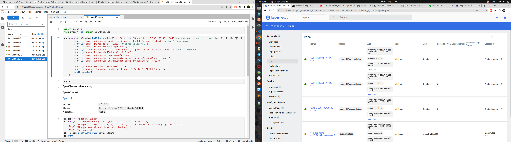

## spark k8s jupyterhub, anaconda environment
- Spark in k8s on jupyterhub materials
---
 

- Blog post https://dev.to/akoshel/spark-on-k8s-in-jupyterhub-1da2
- If using minikube, `minikube ip` to get ip of master
```
kubectl apply -f spark_ns.yaml
kubectl apply -f spark_sa.yaml
kubectl apply -f spark_sa_role.yaml
```
---
```
spark-submit \
  --master k8s://https://192.168.49.2:8443 \
  --deploy-mode cluster \
  --driver-memory 1g \
  --conf spark.kubernetes.memoryOverheadFactor=0.5 \
  --name sparkpi-test1 \
  --class org.apache.spark.examples.SparkPi \
  --conf spark.kubernetes.container.image=ducdn01/spark:latest \
  --conf spark.kubernetes.driver.pod.name=spark-test1-pi \
  --conf spark.kubernetes.namespace=spark \
  --conf spark.kubernetes.authenticate.driver.serviceAccountName=spark \
  --verbose \
  local:///opt/spark/examples/jars/spark-examples_2.12-3.2.2.jar 1000
```
---
Example pyspark in notebook
```
kubectl apply -f jupyterhub_ns.yaml 
kubectl apply -f jupyterhub_sa.yaml
kubectl apply -f jupyterhub_sa_role.yaml

kubectl apply -f driver_service.yaml
```

```
spark = (
    SparkSession.builder.appName("hello").master("k8s://https://192.168.49.2:8443") # Your master address name
    .config("spark.kubernetes.container.image", "ducdn01/pyspark:latest") # Spark image name
    .config("spark.driver.port", "2222") # Needs to match svc
    .config("spark.driver.blockManager.port", "7777")
    .config("spark.driver.host", "driver-service.jupyterhub.svc.cluster.local") # Needs to match svc
    .config("spark.driver.bindAddress", "0.0.0.0")
    .config("spark.kubernetes.namespace", "spark")
    .config("spark.kubernetes.authenticate.driver.serviceAccountName", "spark")
    .config("spark.kubernetes.authenticate.serviceAccountName", "spark")

    .config("spark.executor.instances", "2")
    .config("spark.kubernetes.container.image.pullPolicy", "IfNotPresent")
    .getOrCreate()
)
```
---
JupyterHub Helm Chart
```
helm upgrade --cleanup-on-fail \
--install jupyterhub jupyterhub/jupyterhub \
--namespace jupyterhub \
--create-namespace \
--version=2.0.0 \
--values jhub_values.yaml
```

```
from pyspark.sql import SparkSession

simpleData = [("James","Sales","NY",90000,34,10000),
    ("Michael","Sales","NY",86000,56,20000),
    ("Robert","Sales","CA",81000,30,23000),
    ("Maria","Finance","CA",90000,24,23000),
    ("Raman","Finance","CA",99000,40,24000),
    ("Scott","Finance","NY",83000,36,19000),
    ("Jen","Finance","NY",79000,53,15000),
    ("Jeff","Marketing","CA",80000,25,18000),
    ("Kumar","Marketing","NY",91000,50,21000)
  ]

schema = ["employee_name","department","state","salary","age","bonus"]
df = spark.createDataFrame(data=simpleData, schema = schema)
df.printSchema()
df.show(truncate=False)

df.groupBy("department").sum("salary").show(truncate=False)
```

```
/var/run/secrets/kubernetes.io/serviceaccount
```
---
### Actice anaconda eviroment
- Create enviroment anaconda
```
conda create --name <env_name>
```
- Activate env
```
source activate <env_name>
```
- Install ipykernel
```
conda install ipykernel
```
- Add kernel in JupyterHub
```
python -m ipykernel install --user --name <enviroment name> –display-name "your name eviroment"
```
- Check anaconda in JupyterHub
```
import conda

anaconda_version = conda.__version__
print("Phiên bản Anaconda đang được sử dụng là:", anaconda_version)
```
- References: https://towardsdatascience.com/get-your-conda-environment-to-show-in-jupyter-notebooks-the-easy-way-17010b76e874
---
#### Uninstall kernel not uninstall env anaconda
```
jupyter kernelspec uninstall new-env
```
